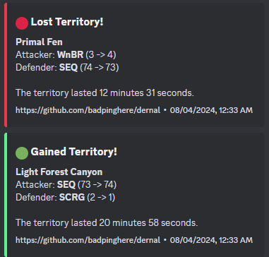

<h1 align="center">
  Dernal.py
</h1>

<h4 align="center">A lightweight and easy-to-use discord bot for all guild activities in <a href="https://wynncraft.com/" target="_blank">Wynncraft</a>.</h4>

<p align="center">
  <a href="#features">Features</a> •
  <a href="#how-to-use">How To Use</a> •
  <a href="#download">Download</a> •
  <a href="#credits">Credits</a> •
  <a href="#license">License</a>
</p>



## Features

This is a quite versitile discord bot, with a few commands, like:

- **Detector**, a background task you can set up to passively track all things guild wars, including:
  - When and who takes your territory, at what time, and how long it lasted
  - When you take someone eles's territory, how long it lasted, and who it was taken from.
  - Pings for when you lose a territory, and a customizable cooldown
  - Compatability with running with multiple guilds at once.
- **Guild Lookup**, a self explanatory command that allows you to have information about a guild, including:
  - Owner, Online players, and guild level
  - Current territory count and war count
  - Top Season rankings and top contributing members

## How To Use

To use this discord bot, you need to either pick the legacy, webhook version, or the supported discord bot.

#### Discord bot

If you trust the hosting to us, you can simply invite the bot [here](https://discord.com/oauth2/authorize?client_id=1270960638382051368), but you can always host the bot yourself. For those inclined to follow hosting, I give no guarantee to reliability, but in terms of safety, this bot has very barebones permissions, only allowing it to read all channels and send messages, along with reactions for future updates. You can always tweak these to your needs, as the only _truly_ required permission is slash commands and sending messages.

To clone and run this discord bot, you'll need [Git](https://git-scm.com), [Python](https://www.python.org/downloads/) and [Pip](https://nodejs.org/en/download/) installed on your computer. From your command line:

```bash
# Clone this repository
$ git clone https://github.com/badpinghere/dernal

# Go into the repository
$ cd dernal

# Install dependencies
$ pip install requirements.txt

# Add your bot token to client.run('Bot Token Here')
$ nano dernal.py

# Run the app
$ python dernal.py
```

#### Webhook Script

To clone and run this webhook script, you'll need [Git](https://git-scm.com), [Python](https://www.python.org/downloads/) and [Pip](https://nodejs.org/en/download/) installed on your computer. From your command line:

```bash
# Clone this repository
$ git clone https://github.com/badpinghere/dernal

# Go into the repository
$ cd dernal

# Install dependencies
$ pip install requirements_legacy.txt

# Rename and edit config_template.ini
$ mv config_template.ini config.ini
$ nano config.ini

# Run the app
$ python dernal_legacy.py
```

## Download

You can [download](https://github.com/BadPingHere/dernal/releases/latest) the latest installable version of dernal.py for Windows, macOS and Linux.

## Credits

This software was inspired by:

- BoxFot
- Nori

## License

GPLv3

---

> [badpinghere.tech](https://badpinghere.tech) &nbsp;&middot;&nbsp;
> GitHub [@BadPingHere](https://github.com/BadPingHere)&nbsp;&middot;&nbsp;
> Discord [Ping#6175](https://discord.com/users/736028271153512489)
