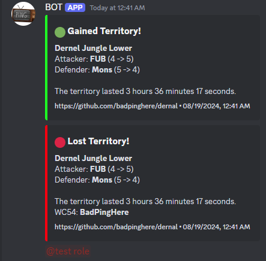

<h1 align="center">
  Dernal.py
</h1>

<h4 align="center">A lightweight and easy-to-use discord bot for all guild activities in <a href="https://wynncraft.com/" target="_blank">Wynncraft</a>.</h4>

<p align="center">
  <a href="#features">Features</a> •
  <a href="#how-to-use">How To Use</a> •
  <a href="#download">Download</a> •
  <a href="#credits">Credits</a> •
  <a href="#license">License</a>
</p>



## Features

This is a quite versitile discord bot, with a few commands, like:

- **Detector**, a background task you can set up to passively track all things guild wars, including:
  - When and who takes your territory, at what time, and how long it lasted
  - When you take someone eles's territory, how long it lasted, and who it was taken from.
  - A somewhat accurate list of attacking members, and what world they were on.
  - Pings for when you lose a territory, and a customizable cooldown
  - Compatability with running with multiple guilds at once.
  - A command which auto-fills what you are detecting, and allows you to remove it.
- **Guild Lookup**, a self explanatory command that allows you to have information about a guild, including:
  - Owner, Online players, and guild level
  - Current territory count and war count
  - Top Season rankings and top contributing members

> [!NOTE]  
> If you want a role to be pinged with detector, due to it's locked down nature, you either have to allow that role to be pinged by everyone, or give the bot permissions to ping every role, including @everyone and @here. If you are self hosting, or trust our hosting, do the latter. If you dont trust our hosting do the former.

## How To Use

To use this discord bot, you need to either pick the legacy, webhook version, or the supported discord bot.

#### Discord bot

We will not be hosting the bot for other guilds, meaning we cannot simply give out bot invite links. This is due to the api limits of wynncraft being 120 requests per minute, and having multiple servers using the same ip for requests means servers would have to allocated to 10 requests per minute, which would not be enough. In the event that the api changes, and we can do more than 120 requests per minute, we will host the bot for everyone, but until then, you will need to host the bot yourself

To clone and run this discord bot, you'll need [Git](https://git-scm.com), [Python](https://www.python.org/downloads/) and [Pip](https://nodejs.org/en/download/) installed on your computer. From your command line:

```bash
# Clone this repository
$ git clone https://github.com/badpinghere/dernal

# Go into the repository
$ cd dernal

# Install dependencies
$ pip install -r requirements.txt

# Add your bot token to client.run('Bot Token Here')
$ nano dernal.py

# Run the app
$ python dernal.py
```

#### Webhook Script

To clone and run this webhook script, you'll need [Git](https://git-scm.com), [Python](https://www.python.org/downloads/) and [Pip](https://nodejs.org/en/download/) installed on your computer. From your command line:

```bash
# Clone this repository
$ git clone https://github.com/badpinghere/dernal

# Go into the repository
$ cd dernal

# Install dependencies
$ pip install -r requirements_legacy.txt

# Rename and edit config_template.ini
$ mv config_template.ini config.ini
$ nano config.ini

# Run the app
$ python dernal_legacy.py
```

## Download

You can [download](https://github.com/BadPingHere/dernal/releases/latest) the latest installable version of dernal.py for Windows, macOS and Linux.

## Credits

This software was inspired by:

- BoxFot
- [Nori](https://nori.fish)

## License

GPLv3

---

> [badpinghere.tech](https://badpinghere.tech) &nbsp;&middot;&nbsp;
> GitHub [@BadPingHere](https://github.com/BadPingHere)&nbsp;&middot;&nbsp;
> Discord [Ping#6175](https://discord.com/users/736028271153512489)
